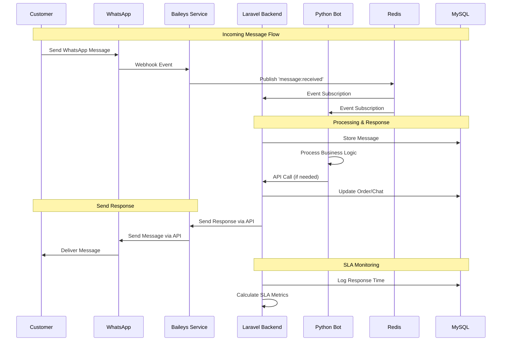

<p align="center">
  
  
  
  
  
  
  
</p>

<h1 align="center">WhatsApp SLA Monitoring System</h1>
<h3 align="center">Enterprise WhatsApp Automation with Hybrid Architecture</h3>

<p align="center">
  
  
  
  
  
</p>

<p align="center">
  <a href="#tentang-proyek">Tentang</a> •
  <a href="#arsitektur">Arsitektur</a> •
  <a href="#fitur-utama">Fitur</a> •
  <a href="#tech-stack">Tech Stack</a> •
  <a href="#instalasi">Instalasi</a> •
  <a href="#authentication-flow">Auth Flow</a> •
  <a href="#testing">Testing</a> •
  <a href="#troubleshooting">Troubleshooting</a> •
  <a href="#kontributor">Kontributor</a>
</p>

---

## Tentang Proyek

**WhatsApp SLA** adalah sistem monitoring dan otomasi WhatsApp enterprise dengan arsitektur hybrid yang menggabungkan:

- **Laravel Backend** - Web dashboard, API management, database operations
- **Baileys Service (Node.js)** - WhatsApp Web API dengan session management
- **Python Bot** - Legacy message handling dan business logic
- **Real-time Integration** - Redis pub/sub untuk komunikasi antar service

Sistem ini dirancang untuk bisnis yang membutuhkan:
- SLA monitoring dan response time tracking
- Multi-channel WhatsApp integration (Web API + Business API)
- Scalable microservice architecture
- Real-time dashboard dan analytics
- Enterprise-grade security dan reliability

---

## Arsitektur

### System Architecture

```
┌─────────────────────────────────────────────────────────────────────────────┐
│                         WHATSAPP SLA MONITORING SYSTEM                      │
├─────────────────────────────────────────────────────────────────────────────┤
│                                                                             │
│   ┌──────────────┐         ┌──────────────┐         ┌──────────────┐       │
│   │   Customer   │◄───────►│   WhatsApp   │◄───────►│ Meta Business│       │
│   │  (WhatsApp)  │         │   Platform   │         │     API      │       │
│   └──────────────┘         └──────┬───────┘         └──────┬───────┘       │
│                                   │                         │               │
│   ─ ─ ─ ─ ─ ─ ─ ─ ─ ─ ─ ─ ─ ─ ─ ─│─ ─ ─ ─ ─ ─ ─ ─ ─ ─ ─ ─ ─│─ ─ ─ ─ ─ ─   │
│                                   ▼                         ▼               │
│   ┌─────────────────────────────────────────────────────────────────────┐  │
│   │                        HYBRID SERVICE LAYER                        │  │
│   │                                                                     │  │
│   │   ┌─────────────────┐   ┌─────────────────┐   ┌─────────────────┐  │  │
│   │   │ LARAVEL BACKEND │   │ BAILEYS SERVICE │   │   PYTHON BOT    │  │  │
│   │   │ ─────────────── │   │ ─────────────── │   │ ─────────────── │  │  │
│   │   │ • REST API      │◄─►│ • WhatsApp Web  │◄─►│ • Legacy Logic  │  │  │
│   │   │ • Web Dashboard │   │ • Session Mgmt  │   │ • Message Handle│  │  │
│   │   │ • SLA Monitor   │   │ • QR/Pairing    │   │ • Business Rules│  │  │
│   │   │ • User Mgmt     │   │ • Event Bridge  │   │ • Notification  │  │  │
│   │   │ • Database      │   │ • TypeScript    │   │ • Async Tasks   │  │  │
│   │   └─────────┬───────┘   └─────────┬───────┘   └─────────┬───────┘  │  │
│   │             │                     │                     │          │  │
│   └─────────────┼─────────────────────┼─────────────────────┼──────────┘  │
│                 │                     │                     │             │
│   ─ ─ ─ ─ ─ ─ ─ ─│─ ─ ─ ─ ─ ─ ─ ─ ─ ─ ─│─ ─ ─ ─ ─ ─ ─ ─ ─ ─ ─│─ ─ ─ ─ ─ ─   │
│                 │                     │                     │             │
│   ┌─────────────┼─────────────────────┼─────────────────────┼─────────┐   │
│   │             ▼         DATA &      ▼         EVENT       ▼         │   │
│   │                      CACHE                  BUS                    │   │
│   │   ┌─────────────────┐       ┌─────────────────┐ ┌─────────────────┐│   │
│   │   │      MySQL      │       │      Redis      │ │   Event Stream  ││   │
│   │   │ ─────────────── │       │ ─────────────── │ │ ─────────────── ││   │
│   │   │ • Users/Roles   │       │ • Session Cache │ │ • QR Generated  ││   │
│   │   │ • Products      │       │ • Queue Jobs    │ │ • Auth Events   ││   │
│   │   │ • Orders        │       │ • Rate Limiting │ │ • Message Flow  ││   │
│   │   │ • Chats/SLA     │       │ • Real-time     │ │ • SLA Metrics   ││   │
│   │   │ • Analytics     │       │ • Pub/Sub       │ │ • Notifications ││   │
│   │   └─────────────────┘       └─────────────────┘ └─────────────────┘│   │
│   │                                                                     │   │
│   └─────────────────────────────────────────────────────────────────────┘   │
│                                                                             │
└─────────────────────────────────────────────────────────────────────────────┘
```

### Service Communication Flow



---

## Fitur Utama

### 🚀 Core Features
| Fitur | Deskripsi | Technology |
|-------|-----------|------------|
| **Multi-Service Architecture** | Laravel + Node.js + Python hybrid system | Microservices |
| **Real-time WhatsApp Integration** | QR Code & Pairing Code authentication | Baileys + Meta API |
| **SLA Monitoring** | Response time tracking & analytics | Laravel Analytics |
| **Session Management** | Persistent WhatsApp sessions dengan backup | Multi-file Auth State |
| **Event-Driven Communication** | Redis pub/sub antar services | Redis Streams |
| **Auto-Reconnect** | Smart reconnection dengan exponential backoff | TypeScript |

### 📊 Business Features
| Fitur | Deskripsi |
|-------|-----------|
| **Order Management** | Full order lifecycle dari WhatsApp ke delivery |
| **Product Catalog** | Dynamic product catalog dengan media support |
| **Customer Support** | Multi-operator chat assignment system |
| **Analytics Dashboard** | Real-time metrics, charts, dan SLA reports |
| **Role-based Access** | Admin, operator, dan viewer permissions |
| **Automated Notifications** | Order status updates via WhatsApp |

### 🔧 Technical Features
| Fitur | Deskripsi |
|-------|-----------|
| **TypeScript API** | Full type safety untuk Baileys integration |
| **Rate Limiting** | API protection dan WhatsApp rate compliance |
| **Queue System** | Background job processing dengan Redis |
| **Docker Support** | Containerized deployment ready |
| **Testing Suite** | 43+ test files dengan comprehensive coverage |
| **Security Hardening** | Input validation, CSRF protection, secure sessions |

---

## Tech Stack

### Backend Services
| Service | Technology | Version | Purpose |
|---------|------------|---------|---------|
| **Laravel Backend** | PHP | 8.2+ | Web API, Dashboard, Database |
| **Baileys Service** | Node.js + TypeScript | 18+ | WhatsApp Web Integration |
| **Python Bot** | Python | 3.11+ | Legacy logic, Business rules |

### Core Technologies
| Technology | Version | Purpose |
|------------|---------|---------|
| Laravel | 11.x | Web framework & API |
| TypeScript | 5.x | Type-safe Baileys service |
| MySQL | 8.0+ | Primary database |
| Redis | 7.x | Cache, queue, pub/sub |
| Docker | latest | Containerization |

### Frontend & UI
| Technology | Version | Purpose |
|------------|---------|---------|
| React | 18.x | Dashboard UI |
| Inertia.js | 1.x | SPA without API |
| Tailwind CSS | 3.x | Styling framework |
| Chart.js | 4.x | Analytics charts |

### DevOps & Testing
| Technology | Purpose |
|------------|---------|
| Jest | TypeScript testing |
| PHPUnit | Laravel testing |
| GitHub Actions | CI/CD pipeline |
| Docker Compose | Local development |

---

## Instalasi

### Prerequisites

**Required Software:**
- PHP >= 8.2 dengan extensions: BCMath, Ctype, JSON, Mbstring, OpenSSL, PDO, Tokenizer, XML
- Composer 2.x
- Node.js >= 18 & npm
- Python >= 3.11
- MySQL >= 8.0
- Redis >= 7.0
- Git

### Quick Start dengan Docker

```bash
# Clone repository
git clone https://github.com/el-pablos/whatsapp-sla.git
cd whatsapp-sla

# Start all services
docker-compose up -d

# Setup Laravel
docker-compose exec app composer install
docker-compose exec app php artisan migrate --seed

# Akses aplikasi
open http://localhost:8000
```

### Manual Installation

#### 1. Clone Repository

```bash
git clone https://github.com/el-pablos/whatsapp-sla.git
cd whatsapp-sla
```

#### 2. Setup Laravel Backend

```bash
# Install PHP dependencies
composer install

# Copy environment file
cp .env.example .env

# Generate application key
php artisan key:generate

# Configure database di .env, lalu jalankan migration
php artisan migrate --seed

# Install frontend dependencies
npm install && npm run build
```

#### 3. Setup Baileys Service

```bash
# Masuk ke direktori baileys service
cd baileys-service

# Install dependencies
npm install

# Copy environment configuration
cp .env.example .env

# Build TypeScript
npm run build
```

#### 4. Setup Python Bot

```bash
# Masuk ke direktori bot
cd bot

# Buat virtual environment
python -m venv venv

# Aktivasi virtual environment
# Windows:
venv\Scripts\activate
# Linux/Mac:
source venv/bin/activate

# Install dependencies
pip install -r requirements.txt
```

#### 5. Configure Services

Update `.env` dengan konfigurasi yang diperlukan:

```env
# Database
DB_CONNECTION=mysql
DB_HOST=127.0.0.1
DB_PORT=3306
DB_DATABASE=whatsapp_sla
DB_USERNAME=root
DB_PASSWORD=your_password

# Redis
REDIS_HOST=127.0.0.1
REDIS_PORT=6379

# WhatsApp Business API (optional)
WA_ACCESS_TOKEN=your_meta_token
WA_VERIFY_TOKEN=your_verify_token
WA_APP_SECRET=your_app_secret

# Baileys Configuration
BAILEYS_SESSION_PATH=./sessions
BAILEYS_API_PORT=3002
BAILEYS_WEBHOOK_URL=http://127.0.0.1:8000/api/whatsapp/webhook
```

---

## Menjalankan Aplikasi

### Development Mode

**Terminal 1: Laravel Backend**
```bash
php artisan serve
# Akses: http://localhost:8000
```

**Terminal 2: Vite Dev Server**
```bash
npm run dev
# Hot reload untuk frontend development
```

**Terminal 3: Queue Worker**
```bash
php artisan queue:work
# Background job processing
```

**Terminal 4: Baileys Service**
```bash
cd baileys-service
npm run dev
# WhatsApp service: http://localhost:3002
```

**Terminal 5: Python Bot (Optional)**
```bash
cd bot
source venv/bin/activate  # Linux/Mac
python main.py
# Legacy bot for existing workflows
```

### Production Mode

```bash
# Build frontend assets
npm run build

# Optimize Laravel
php artisan config:cache
php artisan route:cache
php artisan view:cache

# Start services dengan process manager
pm2 start ecosystem.config.js
```

---

## Authentication Flow

### WhatsApp Authentication Methods

#### 1. QR Code Authentication (Recommended)

```bash
# Start Baileys service
cd baileys-service && npm start

# Get QR code via API
curl http://localhost:3002/auth/qr

# Scan QR dengan WhatsApp app:
# WhatsApp > Settings > Linked Devices > Link a Device
```

#### 2. Pairing Code Authentication

```bash
# Request pairing code via API
curl -X POST http://localhost:3002/auth/pairing \
  -H "Content-Type: application/json" \
  -d '{"phoneNumber": "628xxx"}'

# Enter code di WhatsApp:
# WhatsApp > Settings > Linked Devices > Link with phone number instead
```

#### 3. Session Management

```typescript
// Session otomatis tersimpan dan di-restore
// File lokasi: baileys-service/sessions/
// - creds.json (credentials)
// - keys/ (encryption keys)
// - session-metadata.json (tracking info)

// Backup session
const sessionStore = new SessionStore('./sessions', 'default');
await sessionStore.backupSession();

// Restore dari backup
await sessionStore.restoreFromBackup('./sessions_backup_2024-03-26');
```

### Web Dashboard Authentication

```bash
# Default admin credentials
Email: admin@whatsapp-sla.com
Password: password

# Create new user
php artisan make:user

# Reset password
php artisan tinker
User::where('email', 'admin@example.com')->first()->update([
    'password' => Hash::make('newpassword')
]);
```

---

## API Documentation

### Base URLs

```
Laravel Backend: http://localhost:8000/api/v1
Baileys Service: http://localhost:3002
```

### Authentication

**Laravel API:**
```bash
# Login untuk mendapat token
curl -X POST http://localhost:8000/api/auth/login \
  -H "Content-Type: application/json" \
  -d '{"email": "admin@example.com", "password": "password"}'

# Gunakan token untuk request selanjutnya
curl -H "Authorization: Bearer YOUR_TOKEN" \
  http://localhost:8000/api/products
```

### Key Endpoints

#### WhatsApp Management (Baileys Service)

| Method | Endpoint | Description |
|--------|----------|-------------|
| GET | `/health` | Service health check |
| GET | `/auth/qr` | Get QR code untuk authentication |
| POST | `/auth/pairing` | Request pairing code |
| POST | `/auth/logout` | Logout dan clear session |
| POST | `/messages/send` | Send WhatsApp message |
| GET | `/status` | Get connection status |

#### Business API (Laravel Backend)

| Method | Endpoint | Description |
|--------|----------|-------------|
| GET | `/products` | List products dengan pagination |
| POST | `/orders` | Create new order |
| GET | `/chats` | List active chats |
| POST | `/chats/{id}/messages` | Send message via chat |
| GET | `/analytics/sla` | Get SLA metrics |

### Response Format

```json
{
  "success": true,
  "message": "Operation successful",
  "data": {
    "id": "uuid",
    "attributes": {}
  },
  "meta": {
    "pagination": {
      "current_page": 1,
      "total": 100,
      "per_page": 15
    }
  }
}
```

---

## Testing

### Test Coverage Overview

- **Total Test Files:** 43+
- **Laravel Tests:** PHPUnit dengan Feature & Unit tests
- **Baileys Tests:** Jest dengan TypeScript support
- **Coverage Target:** >80% code coverage

### Running Tests

#### Laravel Tests

```bash
# Run all Laravel tests
php artisan test

# Run specific test suite
php artisan test --testsuite=Feature

# Run with coverage
php artisan test --coverage

# Run specific test file
php artisan test tests/Feature/OrderTest.php
```

#### Baileys Service Tests

```bash
cd baileys-service

# Run all TypeScript tests
npm test

# Watch mode untuk development
npm run test:watch

# Coverage report
npm run test:coverage
```

#### Integration Tests

```bash
# Test full integration flow
php artisan test tests/Feature/WhatsAppIntegrationTest.php

# Test API endpoints
php artisan test tests/Feature/Api/

# Test authentication flow
npm test tests/auth/
```

### Test Structure

```
tests/
├── Feature/                # Laravel feature tests
│   ├── Api/               # API endpoint tests
│   ├── Auth/              # Authentication tests
│   ├── WhatsApp/          # WhatsApp integration tests
│   └── Dashboard/         # Web dashboard tests
├── Unit/                  # Laravel unit tests
│   ├── Models/            # Model tests
│   ├── Services/          # Service layer tests
│   └── Helpers/           # Utility tests
└── baileys-service/tests/ # TypeScript tests
    ├── socket.test.ts     # Socket functionality
    ├── auth/              # Auth handler tests
    └── handlers/          # Event handler tests
```

### Testing Best Practices

1. **Mock External Services:** WhatsApp API, Redis connections
2. **Use Factories:** Generate test data dengan Laravel factories
3. **Test Isolation:** Each test menggunakan fresh database
4. **Error Scenarios:** Test error handling dan edge cases
5. **Performance Tests:** Load testing untuk high-traffic scenarios

---

## Troubleshooting

### Common Issues

#### 🔴 WhatsApp Connection Issues

**Problem:** QR code tidak muncul atau expired
```bash
# Check Baileys service status
curl http://localhost:3002/health

# Clear session dan restart
cd baileys-service
rm -rf sessions/*
npm restart

# Check logs
npm run logs
```

**Problem:** "Session expired" atau "Logged out"
```bash
# Backup existing session
cp -r sessions/ sessions_backup/

# Clear dan re-authenticate
rm -rf sessions/
# Scan QR code lagi atau gunakan pairing code
```

#### 🟡 Laravel Backend Issues

**Problem:** Database connection failed
```bash
# Check database credentials
php artisan config:clear
php artisan migrate:status

# Test database connection
php artisan tinker
DB::connection()->getPdo();
```

**Problem:** Queue jobs tidak berjalan
```bash
# Check queue configuration
php artisan queue:failed
php artisan queue:retry all

# Restart queue worker
php artisan queue:restart
php artisan queue:work --verbose
```

#### 🟠 Redis Connection Issues

**Problem:** Redis connection refused
```bash
# Check Redis status
redis-cli ping

# Check Laravel Redis config
php artisan tinker
Redis::ping();

# Check Baileys Redis connection
cd baileys-service
npm run test:redis
```

#### ⚪ Performance Issues

**Problem:** Slow API response
```bash
# Enable Laravel debugging
php artisan debugbar:enable

# Check database queries
php artisan telescope:install

# Profile Baileys service
cd baileys-service
npm run profile
```

### Debug Mode

**Laravel Debug Mode:**
```env
APP_DEBUG=true
LOG_LEVEL=debug
```

**Baileys Debug Mode:**
```env
BAILEYS_LOG_LEVEL=debug
```

**Python Bot Debug:**
```bash
cd bot
python main.py --debug
```

### Log Locations

```
Laravel: storage/logs/laravel.log
Baileys: baileys-service/logs/
Python: bot/logs/
Redis: /var/log/redis/redis.log
```

### Performance Monitoring

```bash
# Laravel performance
php artisan route:list --compact
php artisan queue:monitor

# Baileys memory usage
cd baileys-service
npm run monitor

# Database performance
mysql -u root -p -e "SHOW PROCESSLIST;"
```

---

## Deployment

### Docker Production

```bash
# Production deployment
docker-compose -f docker-compose.prod.yml up -d

# Scale services
docker-compose up --scale baileys-service=3

# Health checks
docker-compose ps
docker-compose logs
```

### Manual Production Setup

```bash
# Server requirements
# - Ubuntu 20.04+ / CentOS 8+
# - PHP 8.2, Node.js 18+, Python 3.11+
# - MySQL 8.0, Redis 7+, Nginx

# Deploy Laravel
php artisan config:cache
php artisan route:cache
php artisan view:cache

# Build Baileys service
cd baileys-service
npm run build
pm2 start dist/index.js --name baileys-service

# Setup supervisor untuk queue workers
# Setup nginx untuk load balancing
```

### Environment Variables

**Production .env:**
```env
APP_ENV=production
APP_DEBUG=false
APP_URL=https://your-domain.com

# Database
DB_HOST=your-db-host
DB_DATABASE=whatsapp_sla_prod
DB_USERNAME=app_user
DB_PASSWORD=secure_password

# Redis
REDIS_HOST=your-redis-host
REDIS_PASSWORD=redis_password

# WhatsApp
WA_ACCESS_TOKEN=production_token
WA_VERIFY_TOKEN=secure_verify_token

# Security
SESSION_SECURE_COOKIE=true
SANCTUM_STATEFUL_DOMAINS=your-domain.com
```

---

## Contributing

### Development Workflow

1. **Fork repository** dan clone locally
2. **Create feature branch** dari `develop`
   ```bash
   git checkout develop
   git pull origin develop
   git checkout -b feature/amazing-feature
   ```
3. **Setup development environment**
   ```bash
   cp .env.example .env
   composer install
   npm install
   php artisan migrate --seed
   ```
4. **Make changes** dengan tests
5. **Run test suite**
   ```bash
   php artisan test
   cd baileys-service && npm test
   ```
6. **Commit changes** dengan conventional commits
   ```bash
   git commit -m "feat: add amazing feature"
   ```
7. **Push dan create Pull Request**

### Code Standards

- **PHP:** PSR-12, Laravel conventions
- **TypeScript:** Prettier + ESLint
- **Python:** PEP 8, Black formatter
- **Commit Messages:** Conventional commits
- **Tests:** Minimum 80% coverage

### Pull Request Guidelines

- ✅ All tests passing
- ✅ Code coverage maintained
- ✅ Documentation updated
- ✅ Breaking changes documented
- ✅ Performance impact assessed

---

## Kontributor

<table>
  <tr>
    <td align="center">
      <a href="https://github.com/el-pablos">
        <br />
        <sub><b>el-pablos</b></sub>
      </a><br />
      <sub>Project Lead & Architecture</sub>
    </td>
    <td align="center">
      <a href="https://github.com/baileys-core">
        <br />
        <sub><b>baileys-core</b></sub>
      </a><br />
      <sub>Baileys Service & TypeScript</sub>
    </td>
    <td align="center">
      <a href="#">
        <br />
        <sub><b>Your Name</b></sub>
      </a><br />
      <sub>Your Contribution</sub>
    </td>
  </tr>
</table>

### Contributors Map

- **Backend Development:** Laravel API, database design, authentication
- **WhatsApp Integration:** Baileys service, session management, TypeScript
- **Frontend Development:** React dashboard, real-time components
- **DevOps:** Docker, CI/CD, deployment automation
- **Testing:** Test suites, coverage improvement, QA processes
- **Documentation:** API docs, user guides, architecture documentation

---

## License

Distributed under the MIT License. See `LICENSE` file for more information.

```
MIT License

Copyright (c) 2024 WhatsApp SLA Team

Permission is hereby granted, free of charge, to any person obtaining a copy
of this software and associated documentation files (the "Software"), to deal
in the Software without restriction, including without limitation the rights
to use, copy, modify, merge, publish, distribute, sublicense, and/or sell
copies of the Software...
```

---

## Support & Community

### Getting Help

🔗 **Documentation:** [Full documentation](./docs/)
🐛 **Bug Reports:** [GitHub Issues](https://github.com/el-pablos/whatsapp-sla/issues)
💡 **Feature Requests:** [GitHub Discussions](https://github.com/el-pablos/whatsapp-sla/discussions)
📧 **Email:** support@whatsapp-sla.com

### Community Guidelines

- Be respectful dan professional
- Use Indonesian atau English
- Search existing issues sebelum create new
- Provide detailed information untuk bug reports
- Include code examples ketika possible

### Roadmap

**Q2 2024:**
- [ ] Multi-tenant support
- [ ] Advanced analytics dashboard
- [ ] WhatsApp Web API v2 integration
- [ ] Mobile app (React Native)

**Q3 2024:**
- [ ] AI-powered auto-responses
- [ ] Integration dengan CRM systems
- [ ] Advanced SLA reporting
- [ ] Load balancing improvements

---

<p align="center">
  <strong>Built with ❤️ for Indonesian businesses</strong>
  <br/>
  <sub>WhatsApp SLA - Enterprise WhatsApp Automation System</sub>
  <br/>
  <sub>Making customer communication seamless dan scalable</sub>
</p>
