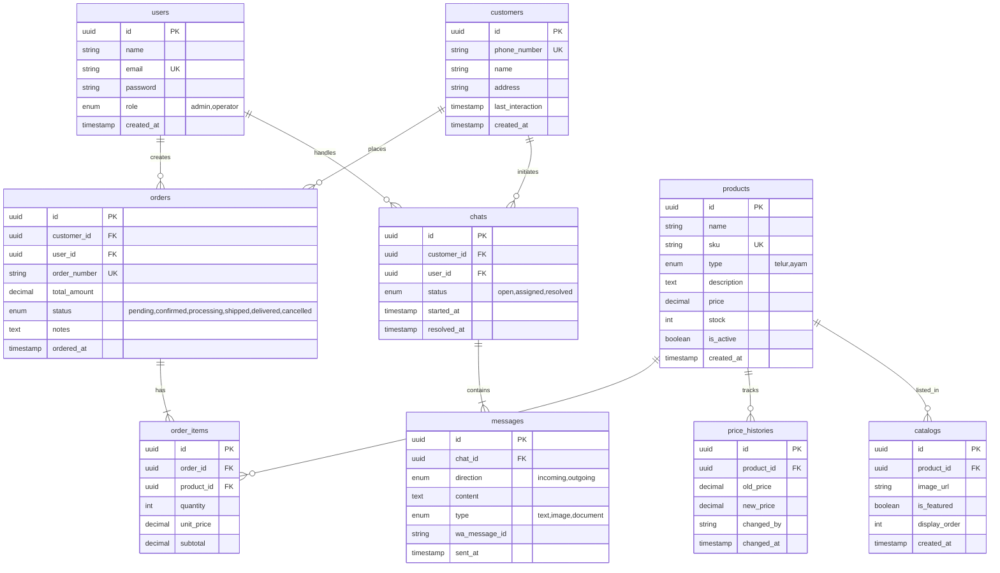
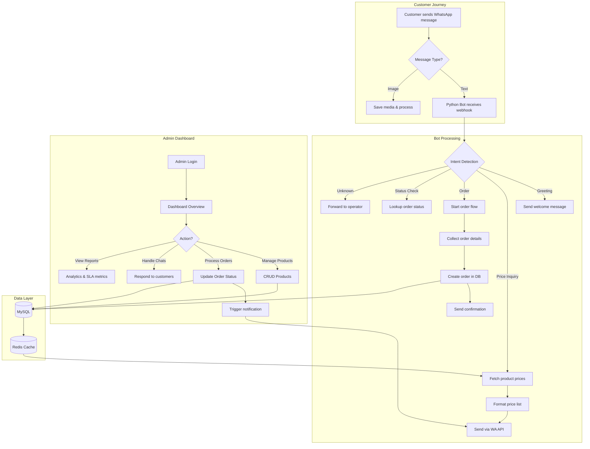

<p align="center">
  
  
  
  
  
</p>

<h1 align="center">WhatsApp SLA Chatbot</h1>
<h3 align="center">Sistem Otomasi Layanan Pelanggan untuk Bisnis Ayam Petelur</h3>

<p align="center">
  
  
  
  
  
</p>

<p align="center">
  <a href="#tentang-proyek">Tentang</a> •
  <a href="#fitur-utama">Fitur</a> •
  <a href="#arsitektur">Arsitektur</a> •
  <a href="#tech-stack">Tech Stack</a> •
  <a href="#instalasi">Instalasi</a> •
  <a href="#api-documentation">API</a> •
  <a href="#kontributor">Kontributor</a>
</p>

---

## Tentang Proyek

**WhatsApp SLA** adalah sistem chatbot otomatis yang dirancang khusus untuk bisnis peternakan ayam petelur. Sistem ini mengintegrasikan WhatsApp Business API untuk menangani:

- Pemesanan produk (telur & ayam) via chat
- Informasi harga real-time
- Katalog produk interaktif
- Notifikasi status pesanan
- Layanan pelanggan 24/7

Dibangun dengan arsitektur modern yang memisahkan backend API (Laravel) dan bot handler (Python), sistem ini menjamin skalabilitas dan kemudahan maintenance.

---

## Fitur Utama

| Fitur | Deskripsi |
|-------|-----------|
| **Auto-Reply Bot** | Respon otomatis untuk pertanyaan umum pelanggan |
| **Order Management** | Kelola pesanan dari penerimaan hingga pengiriman |
| **Product Catalog** | Katalog digital telur dan ayam dengan harga dinamis |
| **Price History** | Tracking perubahan harga untuk analisis bisnis |
| **Dashboard Analytics** | Visualisasi data penjualan dan chat metrics |
| **Multi-User Support** | Role-based access untuk admin dan operator |
| **SLA Monitoring** | Pantau response time dan service level |

---

## Arsitektur

### System Architecture

```
┌─────────────────────────────────────────────────────────────────────────────┐
│                              WHATSAPP SLA SYSTEM                            │
├─────────────────────────────────────────────────────────────────────────────┤
│                                                                             │
│   ┌──────────────┐         ┌──────────────┐         ┌──────────────┐       │
│   │   Customer   │◄───────►│   WhatsApp   │◄───────►│   Meta API   │       │
│   │  (WhatsApp)  │         │   Business   │         │   Gateway    │       │
│   └──────────────┘         └──────────────┘         └──────┬───────┘       │
│                                                            │               │
│   ─ ─ ─ ─ ─ ─ ─ ─ ─ ─ ─ ─ ─ ─ ─ ─ ─ ─ ─ ─ ─ ─ ─ ─ ─ ─ ─ ─│─ ─ ─ ─ ─ ─   │
│                                                            ▼               │
│   ┌─────────────────────────────────────────────────────────────────────┐  │
│   │                        APPLICATION LAYER                            │  │
│   │                                                                     │  │
│   │   ┌─────────────────────┐       ┌─────────────────────┐            │  │
│   │   │   LARAVEL BACKEND   │       │   PYTHON BOT        │            │  │
│   │   │   ─────────────────  │       │   ─────────────────  │            │  │
│   │   │   • REST API        │◄─────►│   • Message Handler │            │  │
│   │   │   • Web Dashboard   │       │   • Auto Reply      │            │  │
│   │   │   • Auth & RBAC     │       │   • Notification    │            │  │
│   │   │   • Order Process   │       │   • WA API Client   │            │  │
│   │   └──────────┬──────────┘       └──────────┬──────────┘            │  │
│   │              │                             │                        │  │
│   └──────────────┼─────────────────────────────┼────────────────────────┘  │
│                  │                             │                           │
│   ─ ─ ─ ─ ─ ─ ─ ─│─ ─ ─ ─ ─ ─ ─ ─ ─ ─ ─ ─ ─ ─ ─│─ ─ ─ ─ ─ ─ ─ ─ ─ ─ ─ ─   │
│                  │                             │                           │
│   ┌──────────────┼─────────────────────────────┼────────────────────────┐  │
│   │              ▼          DATA LAYER         ▼                        │  │
│   │                                                                     │  │
│   │   ┌─────────────────────┐       ┌─────────────────────┐            │  │
│   │   │       MySQL         │       │       Redis         │            │  │
│   │   │   ─────────────────  │       │   ─────────────────  │            │  │
│   │   │   • Users           │       │   • Session Cache   │            │  │
│   │   │   • Products        │       │   • Queue Jobs      │            │  │
│   │   │   • Orders          │       │   • Rate Limiting   │            │  │
│   │   │   • Chats           │       │   • Real-time Data  │            │  │
│   │   └─────────────────────┘       └─────────────────────┘            │  │
│   │                                                                     │  │
│   └─────────────────────────────────────────────────────────────────────┘  │
│                                                                             │
└─────────────────────────────────────────────────────────────────────────────┘
```

### ERD (Entity Relationship Diagram)



### Application Flowchart



---

## Tech Stack

### Backend
| Technology | Version | Purpose |
|------------|---------|---------|
| PHP | 8.2+ | Server-side language |
| Laravel | 11.x | Web framework |
| MySQL | 8.0+ | Primary database |
| Redis | 7.x | Caching & queue |

### Bot Service
| Technology | Version | Purpose |
|------------|---------|---------|
| Python | 3.11+ | Bot runtime |
| httpx | latest | Async HTTP client |
| redis-py | latest | Redis connection |

### Frontend
| Technology | Version | Purpose |
|------------|---------|---------|
| React | 18.x | UI library |
| Inertia.js | 1.x | SPA adapter |
| Tailwind CSS | 3.x | Styling |

### Infrastructure
| Technology | Purpose |
|------------|---------|
| Docker | Containerization |
| GitHub Actions | CI/CD pipeline |
| Nginx | Web server |

---

## Instalasi

### Prerequisites

Pastikan sistem kamu sudah terinstall:

- PHP >= 8.2 dengan extensions: BCMath, Ctype, JSON, Mbstring, OpenSSL, PDO, Tokenizer, XML
- Composer 2.x
- Node.js >= 18 & npm
- Python >= 3.11
- MySQL >= 8.0
- Redis >= 7.0
- Git

### Step-by-Step Installation

#### 1. Clone Repository

```bash
git clone https://github.com/el-pablos/whatsapp-sla.git
cd whatsapp-sla
```

#### 2. Setup Laravel Backend

```bash
# Install PHP dependencies
composer install

# Copy environment file
cp .env.example .env

# Generate application key
php artisan key:generate

# Configure database di .env, lalu jalankan migration
php artisan migrate --seed

# Install frontend dependencies
npm install

# Build assets
npm run build
```

#### 3. Setup Python Bot

```bash
# Masuk ke direktori bot
cd python-bot

# Buat virtual environment
python -m venv venv

# Aktivasi virtual environment
# Windows:
venv\Scripts\activate
# Linux/Mac:
source venv/bin/activate

# Install dependencies
pip install -r requirements.txt
```

#### 4. Configure Redis

Pastikan Redis server berjalan, lalu update `.env`:

```env
REDIS_HOST=127.0.0.1
REDIS_PORT=6379
REDIS_PASSWORD=null
```

#### 5. Configure WhatsApp Business API

Dapatkan kredensial dari [Meta for Developers](https://developers.facebook.com/), lalu update `.env`:

```env
WA_API_URL=https://graph.facebook.com/v18.0
WA_PHONE_NUMBER_ID=your_phone_number_id
WA_ACCESS_TOKEN=your_access_token
WA_VERIFY_TOKEN=your_verify_token
WA_APP_ID=your_app_id
WA_APP_SECRET=your_app_secret
```

---

## Environment Variables

| Variable | Description | Example |
|----------|-------------|---------|
| `APP_NAME` | Nama aplikasi | `WhatsApp SLA` |
| `APP_ENV` | Environment | `local`, `production` |
| `APP_DEBUG` | Debug mode | `true`, `false` |
| `APP_URL` | Base URL aplikasi | `http://localhost` |
| `DB_CONNECTION` | Database driver | `mysql` |
| `DB_HOST` | Database host | `127.0.0.1` |
| `DB_PORT` | Database port | `3306` |
| `DB_DATABASE` | Nama database | `whatsapp_sla` |
| `DB_USERNAME` | Database user | `root` |
| `DB_PASSWORD` | Database password | `secret` |
| `REDIS_HOST` | Redis host | `127.0.0.1` |
| `REDIS_PORT` | Redis port | `6379` |
| `REDIS_PASSWORD` | Redis password | `null` |
| `WA_PHONE_NUMBER_ID` | WhatsApp Phone ID | `123456789` |
| `WA_ACCESS_TOKEN` | WhatsApp API Token | `EAAxxxxx` |
| `WA_VERIFY_TOKEN` | Webhook verify token | `my_verify_token` |

---

## Menjalankan Aplikasi

### Development Mode

```bash
# Terminal 1: Laravel server
php artisan serve

# Terminal 2: Vite dev server (untuk hot reload)
npm run dev

# Terminal 3: Queue worker
php artisan queue:work

# Terminal 4: Python bot
cd python-bot
python main.py
```

Akses aplikasi di: `http://localhost:8000`

### Production Mode

```bash
# Build frontend assets
npm run build

# Optimize Laravel
php artisan config:cache
php artisan route:cache
php artisan view:cache

# Jalankan dengan supervisor untuk queue & bot
```

### Menggunakan Docker

```bash
# Build dan jalankan semua services
docker-compose up -d

# Akses aplikasi
# Web: http://localhost:8000
# Database: localhost:3306
# Redis: localhost:6379
```

---

## API Documentation

### Authentication

Semua API endpoint (kecuali login) memerlukan Bearer token:

```
Authorization: Bearer {your_token}
```

### Base URL

```
Development: http://localhost:8000/api/v1
Production: https://your-domain.com/api/v1
```

### Endpoints

#### Auth

| Method | Endpoint | Description |
|--------|----------|-------------|
| POST | `/auth/login` | Login dan dapatkan token |
| POST | `/auth/logout` | Logout dan invalidate token |
| GET | `/auth/me` | Get current user info |

#### Products

| Method | Endpoint | Description |
|--------|----------|-------------|
| GET | `/products` | List semua produk |
| GET | `/products/{id}` | Detail produk |
| POST | `/products` | Tambah produk baru |
| PUT | `/products/{id}` | Update produk |
| DELETE | `/products/{id}` | Hapus produk |

#### Orders

| Method | Endpoint | Description |
|--------|----------|-------------|
| GET | `/orders` | List semua pesanan |
| GET | `/orders/{id}` | Detail pesanan |
| POST | `/orders` | Buat pesanan baru |
| PATCH | `/orders/{id}/status` | Update status pesanan |

#### Chats

| Method | Endpoint | Description |
|--------|----------|-------------|
| GET | `/chats` | List semua chat |
| GET | `/chats/{id}` | Detail chat dengan messages |
| POST | `/chats/{id}/messages` | Kirim pesan |
| PATCH | `/chats/{id}/assign` | Assign chat ke operator |

#### Webhook (WhatsApp)

| Method | Endpoint | Description |
|--------|----------|-------------|
| GET | `/webhook` | Verify webhook (Meta verification) |
| POST | `/webhook` | Receive incoming messages |

### Response Format

```json
{
  "success": true,
  "message": "Operation successful",
  "data": {
    // response data here
  },
  "meta": {
    "current_page": 1,
    "total": 100,
    "per_page": 15
  }
}
```

### Error Response

```json
{
  "success": false,
  "message": "Error description",
  "errors": {
    "field_name": ["Validation error message"]
  }
}
```

---

## Project Structure

```
whatsapp-sla/
├── app/
│   ├── Http/
│   │   ├── Controllers/     # API & Web controllers
│   │   ├── Middleware/      # Auth, rate limiting, etc
│   │   └── Requests/        # Form request validation
│   ├── Models/              # Eloquent models
│   ├── Services/            # Business logic services
│   └── Jobs/                # Queue jobs
├── config/                  # Configuration files
├── database/
│   ├── migrations/          # Database migrations
│   └── seeders/            # Data seeders
├── python-bot/
│   ├── handlers/           # Message handlers
│   ├── services/           # Bot services
│   ├── main.py            # Bot entry point
│   └── requirements.txt   # Python dependencies
├── resources/
│   ├── js/                # React components
│   ├── css/               # Stylesheets
│   └── views/             # Blade templates
├── routes/
│   ├── api.php           # API routes
│   └── web.php           # Web routes
├── tests/                # Test suites
├── docker-compose.yml    # Docker configuration
└── README.md            # This file
```

---

## Screenshots

<p align="center">
  <i>Screenshots will be added once the UI is implemented</i>
</p>

| Dashboard | Orders | Chat Monitor |
|-----------|--------|--------------|
|  |  |  |

---

## Kontributor

<table>
  <tr>
    <td align="center">
      <a href="https://github.com/el-pablos">
        <br />
        <sub><b>el-pablos</b></sub>
      </a><br />
      <sub>Project Lead</sub>
    </td>
  </tr>
</table>

### Contributing

Kontribusi sangat diterima! Silakan baca [CONTRIBUTING.md](CONTRIBUTING.md) untuk panduan kontribusi.

1. Fork repository ini
2. Buat feature branch (`git checkout -b feature/AmazingFeature`)
3. Commit changes (`git commit -m 'Add some AmazingFeature'`)
4. Push ke branch (`git push origin feature/AmazingFeature`)
5. Buat Pull Request

---

## License

Distributed under the MIT License. See `LICENSE` for more information.

---

## Support

Jika ada pertanyaan atau butuh bantuan:

- Buat [Issue](https://github.com/el-pablos/whatsapp-sla/issues) untuk bug reports
- Buka [Discussion](https://github.com/el-pablos/whatsapp-sla/discussions) untuk pertanyaan umum

---

<p align="center">
  Made with care for local egg farmers
  <br/>
  <sub>WhatsApp SLA - Ayam Petelur Business Solution</sub>
</p>
