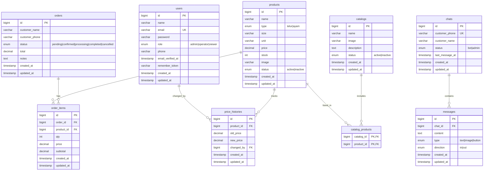

# Entity Relationship Diagram

## WhatsApp SLA - Database Schema

## Relasi Antar Tabel

| Tabel | Relasi | Tabel Target | Keterangan |
|-------|--------|--------------|------------|
| orders | 1:N | order_items | Satu order punya banyak item |
| products | 1:N | order_items | Produk bisa ada di banyak order |
| chats | 1:N | messages | Satu chat punya banyak pesan |
| catalogs | N:M | products | Katalog berisi banyak produk (pivot: catalog_products) |
| products | 1:N | price_histories | Tracking perubahan harga |
| users | 1:N | price_histories | Siapa yang ubah harga |

## Index Strategy

### users
- `email` - UNIQUE (login)
- `role` - INDEX (filter by role)
- `phone` - INDEX (search)

### products
- `type` - INDEX (filter telur/ayam)
- `status` - INDEX (active products)
- `(type, status)` - COMPOSITE (common filter)

### orders
- `customer_phone` - INDEX (customer lookup)
- `status` - INDEX (filter by status)
- `created_at` - INDEX (date range)
- `(status, created_at)` - COMPOSITE (dashboard)

### order_items
- `(order_id, product_id)` - INDEX (item lookup)

### chats
- `customer_phone` - UNIQUE (identify customer)
- `status` - INDEX (bot vs admin)
- `last_message_at` - INDEX (sort by activity)

### messages
- `(chat_id, created_at)` - INDEX (chat history)
- `direction` - INDEX (in/out filter)

### catalogs
- `status` - INDEX (active catalogs)

### catalog_products
- `(catalog_id, product_id)` - PRIMARY (composite key)

### price_histories
- `(product_id, created_at)` - INDEX (price timeline)
